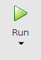
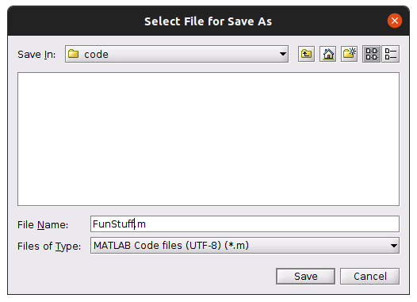
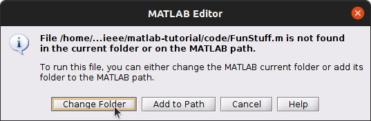
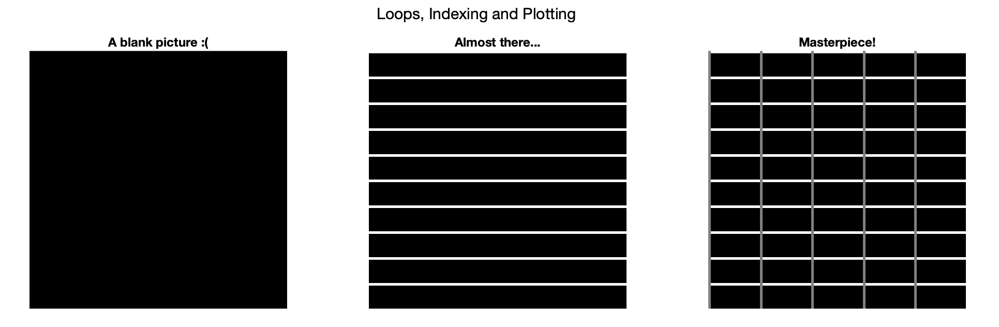

# MATLAB Tutorial

A showcase of the most useful features of MATLAB, for first-year university students

**What we'll cover:**

- Tour of the MATLAB GUI
- Assigning variables, creating arrays, simple math operations, and vector math
  - linspace, colon operator, []
- Writing functions
- Loops / conditionals
- Plotting

# Why MATLAB?

MATLAB is a programming language and coding environment used primarily by engineers and scientists.

It's designed for working with numbers and equations.

This makes it a great tool for performing complex calculations, analyzing data and developing algorithms.

MATLAB is used in a wide variety of engineering applications, including signal processing, control systems, image processing and machine learning.

# 📈Look At This Graph!📉

1. Make a new _script_ by clicking on the "New Script" button
   
2. Type these commands into the blank document:

```octave
t = linspace(0,4*pi,1000);
s = sin(t);
plot(t,s);
```

3. Press the big green **Run** button 
   - Name this new file and save it somewhere you won't forget 
   - Click on "Change Folder" if this window comes up 
4. Look at your cool graph!

MATLAB lets you make mathematical graphs really easily.
MATLAB also helps you do your homework! Let's see how...

# Launch a Projectile

Let's launch a cannonball!
Say the cannonball is shot like this:

- At an angle of `theta` degrees
- At a velocity of `vel` metres per second

Let's ignore air resistance is this case.
High-school physics tells us:

1. The x-component of the ball's velocity stays constant
2. The y-component of the ball's velocity decreases linearly, so the y-component of its position is a quadratic

We're going to plot the path of the ball as it flies through the ~air~ airless void.
First, we'll use the equations of projectile motion to plot the path.
Then, we'll pretend we don't know those equations, and we'll make MATLAB do the thinking!

## Equations of Projectile Motion

To do this, we're going to need the equations for `x(t)` and `y(t)`.

- `x(t) = vel * cos(theta) * t`
- `y(t) = -g/2 * t^2 + vel * sin(theta) * t`

Now we can copy the code from above where we plotted a sine function, and tweak it.

```octave
vel = 20;
theta = 60*(pi/180);

g = 9.81;

t = linspace(0,5,1000);

x = vel * cos(theta) * t;
y = -g/2 * t.^2 + vel * sin(theta) * t;

plot(x,y);
```

## Make MATLAB do the Thinking

This method starts out like the first method:

```octave
vel = 20;
theta = 60*(pi/180);

g = 9.81;

t = linspace(0,5,1000);
```

We'll start with the exact equations for velocity, then we'll let MATLAB calculate position.

```octave
vx = vel * cos(theta);
vy = vel * sin(theta) - g * t;
```

But we **won't** use the exact equations for position.
Instead, we'll just start with the initial position.
Let's say the projectile starts at the position (-5,2).

```octave
x = -5;
y = 2;
```

Then, we'll use a ➿*loop*➿ to calculate the `x` and `y` components of position as the projectile flies!
To do that, we'll need to figure out the time-step between points in `t`.

```octave
time_step = (t(end)-t(1))/(length(t)-1);

for ii = 1:(length(t)-1)
    x(ii+1) = x(ii) + time_step * vx;
    y(ii+1) = y(ii) + time_step * vy(ii);
end

plot(x,y);
```

Try writing these three blocks of code in a single script, then run the script. Do you get the right shape?

### If you're a real keener (and have some extra time)...

MATLAB has lots of tools for making nice-looking plots.

Let's add a title and axis labels to our projectile motion plot:

```octave
title('Projectile Motion of a Cannonball')
xlabel('x')
ylabel('y')
```

Try changing the axis labels to be more descriptive.

If we want to add additonal curves on the same axes, we can use the `hold on` command. This _holds_ the axes so that the current plot is not erased. Try:

```octave
hold on;
plot(x+10, y)
plot(x-10, y)
legend('original plot', 'shifted right', 'shifted left')
```

Note that MATLAB automatically assigns different colours to the curves. You can also choose the colours yourself, or set things like whether the lines are solid, dashed or have markers on the data points.

```octave
figure; 	% this opens a new figure window
hold on;
plot(x, y, 'b')
plot(1.5*x, y, 'mx-')
plot(x, y/2, 'k--')
legend('solid blue line', 'magenta x-shaped markers', 'black dashed line')
```

You can type `help plot` into the command line to see all of the options for this function.

# Write Your English Essay

😩 Nope

# Write a Function

There are a few different ways to create functions in MATLAB. The most common way is to create a new file, starting with the **function** keyword. Note that the name of the file must match the name of the function. Eg. for the function below, I'd make a file called _hello.m._ Also, make sure that the file is saved in your _working directory_.

```octave
function hello(name)
    fprintf('Hello, %s\n', name)
end
```

other things we can do:

- make the function **return** the greeting, instead of printing it
- add other greeting options, besides hello
  - could add a second input argument, use if/else, or switch/case statements
- ensure that the 'name' input is actually a string

# Draw a Picture

In this example, we'll learn about indexing matrices and vectors, and also do some more plotting.

Let's start out with a 100x100 matrix of zeros:

```octave
picture = zeros(100); % this is equivalent to: picture = zeros(100,100);
```

This will look like an all black image:

```octave
figure; subplot(1,3,1)
imshow(picture)
title('A blank picture :(')
```

I'll use a for loop to add horizontal stripes, and then more widely spaced vertical stripes.

```octave
for ii = 1:10:100
    picture(ii, :) = 1;
end
subplot(1,3,2)
imshow(picture)

for jj = 1:20:100
    picture(:, jj) = 0.5;
end
subplot(1,3,3)
imshow(picture)

sgtitle('Loops, Indexing and Plotting in MATLAB!')
```

**_Extra Work:_**
Try putting a **breakpoint** inside one of the for loops so that you can step through it one stripe at a time



# Stats 101

Copy the code below into a new `.m` file, called `random.m`.

Run the script a few times to see how the output in the Command Window changes.

Read through the code and complete the challenges!

```octave
clearvars
clc

% Generate some pseudo-random numbers
randomNumbers = rand([1, 100]); % 100 random numbers between 0 and 1
lowestNumber = min(randomNumbers);
highestNumber = max(randomNumbers);

randomIntegers = randi(10, [1, 50]); % 50 random integers from 1-10
lowestInteger = min(randomIntegers);
highestInteger = max(randomIntegers);

% Print some stats to the command line
fprintf('Length of randomNumbers: %d\n', length(randomNumbers))
fprintf('Lowest number: %.5f\n', lowestNumber)
fprintf('Highest number: %.5f\n', highestNumber)
fprintf('Average number: %.5f\n\n', mean(randomNumbers))

fprintf('Length of randomIntegers: %d\n', length(randomIntegers))
fprintf('Lowest integer: %d\n', lowestInteger)
fprintf('Highest integer: %d\n', highestInteger)
fprintf('Average of integers: %.5f\n\n', mean(randomIntegers))

% Flip a coin and print the results!
% (check out the "coinFlip" function at the bottom of this file)
headsOrTails = coinFlip();
disp(headsOrTails)

% ------------------------ CHALLENGE 1 ------------------------ %
% Use a LOOP to flip a coin (i.e. call the coinFlip() function)
% 100 times, then print the final tally of heads and tails flipped.
numberOfHeads = 0;
numberOfTails = 0;

% your code here!


% ------------------------------------------------------------- %

% ------------------------ CHALLENGE 2 ------------------------ %
% Learn about histograms by typing "help histogram" in the
% command window. Plot a histogram of the "samples"
% variable defined below.
% What happens to your histogram if you increase or decrease
% the length of "samples"?
% Can you tell how the "randn()" function is different from "rand()"
% or "randi()"? Check the MATLAB documentation if you're not sure!

samples = randn([1, 20]);

% put your solution below:


% ------------------------------------------------------------- %

function outcome = coinFlip()
    flip = 2*rand(1) - 1;
    if flip >= 0
        outcome = "Heads!";
    elseif flip < 0
        outcome = "Tails!";
    end
end
```

# Requests for topics to cover

- Operations with complex numbers
- Matrix operations
- Solving systems of equations

# In Closing

We hope you enjoyed this workshop and feel more confident programming in MATLAB!
If you have any questions or would like to get in touch, feel free to reach out by [email](mailto:ieeewiews@gmail.com), on [LinkedIn](https://www.linkedin.com/company/wie-winnipeg/) or on [Instagram](https://www.instagram.com/wie.winnipeg/)
